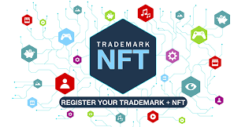
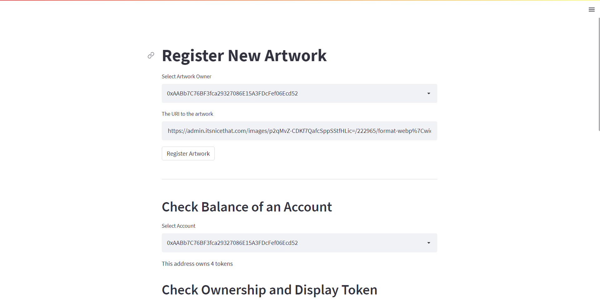
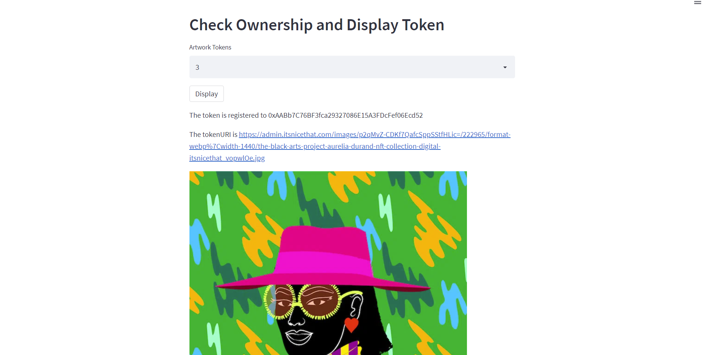

# Register NFT Artwork

  

## Building the Mint-Condition Artwork BackEnd
* The back-end processes performed by the ArtToken smart contract are:
    * The ArtToken contract controls all of the logic associated with the ArtToken NFT
    * It keeps track of each new token, catalogued by tokenId
    * Each tokenId contains references to the owner's address and the URI associated with the asset
    * All of this information will be stored on the blockchain and can be accessed by making a call to the blockchain.

## Tools needed to compile and deploy the contract
Compiling and deploying the ArtToken contract by using the Remix IDE, MetaMask, and Ganache.
* [Remix Ethereum IDE](https://remix.ethereum.org/) - Remix IDE, a no-setup tool with a GUI for compilation and developing smart contracts.
* [MetaMask](https://metamask.io/) - A wallet that serves as the gateway between the Remix IDE and the ganache blockchain.
* [Ethereum Unit Converter](https://eth-converter.com/) - Ether to Wei unit convertor.
* [Ganache](https://trufflesuite.com/ganache/) - provides the accounts and ether needed to deploy and test the smart contracts

## Front End Display Of Artwork Registry

